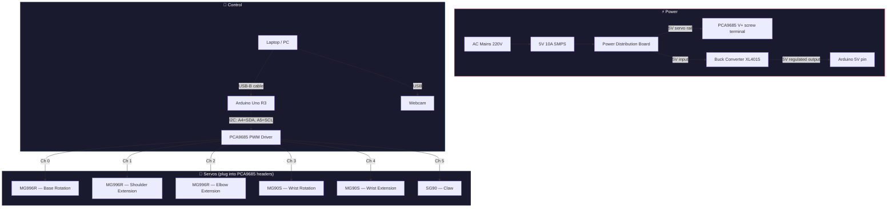

# Complete Wiring & Setup Guide — ArmAutomata 6-DOF

## System Overview



---

## 1. I2C Bus: Arduino ↔ PCA9685

This is the control bus. The Arduino sends servo positions to the PCA9685 chip over I2C using just 2 data wires + power.

Connect using **female-to-female Dupont jumper wires**:

| Arduino Uno Pin | → | PCA9685 Pin | Wire Colour (suggested) |
|:-:|:-:|:-:|:-:|
| **A4** (SDA) | → | **SDA** | 🔵 Blue |
| **A5** (SCL) | → | **SCL** | 🟡 Yellow |
| **GND** | → | **GND** | ⚫ Black |
| **5V** | → | **VCC** | 🔴 Red |

> [!IMPORTANT]
> **VCC** on the PCA9685 is the **logic power** (runs the chip itself). This is completely separate from **V+** which powers the servos. **Both** must be connected for the system to work.

---

## 2. Servo Connections on PCA9685

Each servo comes with a **3-pin cable already attached**. Plug them directly into the PCA9685 channel headers — no extra wires needed.

```
PCA9685 Board (top view)
┌─────────────────────────────────────────────┐
│  V+ ─  GND ─     (screw terminals)         │
│                                             │
│  Ch0  Ch1  Ch2  Ch3  Ch4  Ch5  Ch6 ... Ch15│
│  |||  |||  |||  |||  |||  |||              │
│  SIG  SIG  SIG  SIG  SIG  SIG             │
│  V+   V+   V+   V+   V+   V+              │
│  GND  GND  GND  GND  GND  GND             │
└─────────────────────────────────────────────┘
      ↑     ↑     ↑     ↑     ↑     ↑
   Base  Shld  Elbow WrRot WrExt  Claw
  MG996R MG996R MG996R MG90S MG90S  SG90
```

| PCA9685 Channel | Servo to plug in | Servo Type |
|:-:|:-:|:-:|
| **Ch 0** | Base Rotation | MG996R |
| **Ch 1** | Shoulder Extension | MG996R |
| **Ch 2** | Elbow Extension | MG996R |
| **Ch 3** | Wrist Rotation | MG90S |
| **Ch 4** | Wrist Extension | MG90S |
| **Ch 5** | Claw (gripper) | SG90 |

> [!TIP]
> **Connector orientation**: The 3-pin servo plug has a polarity key. On most PCA9685 boards, the pin order from the board edge inward is: **GND** (brown/black) → **V+** (red) → **Signal** (orange/white). Match the wire colours to avoid reverse-polarity.

> [!WARNING]
> If a servo cable is **too short** to reach the PCA9685, use a **servo extension cable** (3-pin, ~30cm). Do NOT splice jumper wires for servo connections — they can't handle the current.

---

## 3. Power Architecture

### Why a separate power supply?

The 3× MG996R servos can draw up to **2.5A each** at stall (7.5A total). The MG90S and SG90 add another ~2A. The Arduino's 5V pin can only supply ~0.5A — nowhere near enough. That's why you need the **5V 10A SMPS**.

### Power flow diagram

```
┌──────────────┐
│ AC Mains 220V│
└──────┬───────┘
       │
       ▼
┌──────────────┐
│ 5V 10A SMPS  │ ← Converts mains to 5V DC, up to 10A
│ (wall unit)  │
└──────┬───────┘
       │ 5V DC, thick wires
       ▼
┌──────────────────┐
│ Power Distribution│ ← Splits 5V to multiple outputs
│ Board             │
└──┬───────────┬───┘
   │           │
   │           ▼
   │    ┌────────────────┐
   │    │ Buck Converter  │ ← Provides clean, isolated 5V to Arduino
   │    │ XL4015 (→5.0V)  │    (prevents servo noise on logic rail)
   │    └───────┬────────┘
   │            │ 5V clean
   │            ▼
   │     ┌────────────┐
   │     │ Arduino Uno │ ← Connect to the 5V pin (NOT Vin)
   │     │ 5V pin      │    OR just power via USB from laptop
   │     └────────────┘
   │
   ▼
┌──────────────┐
│ PCA9685 V+   │ ← Screw terminal — powers ALL servos
│ screw term.  │
└──────────────┘
```

### 3a. SMPS → Power Distribution Board

| SMPS Output | → | Power Distribution Board |
|:-:|:-:|:-:|
| **+V** (positive output) | → | **VIN+** input terminal |
| **−V / GND** (negative output) | → | **VIN−** input terminal |

Use the **thick wires that came with your SMPS** for this connection (they're rated for high current).

### 3b. Power Distribution Board → PCA9685 (Servo Power)

| Power Distribution Board | → | PCA9685 |
|:-:|:-:|:-:|
| **5V output** | → | **V+** (screw terminal, positive) |
| **GND output** | → | **GND** (screw terminal, negative) |

Use **thick wires** (18–22 AWG) — this carries up to 10A at peak.

> [!CAUTION]
> The PCA9685 **V+ screw terminal** powers ALL six servo motors simultaneously. **Never** connect the Arduino's 5V pin to V+ — the current draw would destroy the Arduino.

### 3c. Power Distribution Board → Buck Converter → Arduino (Optional)

This path provides clean, noise-free power to the Arduino. **If you're powering the Arduino via USB from your laptop, you can skip this.**

| From | → | To |
|:-:|:-:|:-:|
| Power Distribution Board **5V out** | → | Buck Converter **VIN+** |
| Power Distribution Board **GND out** | → | Buck Converter **VIN−** |
| Buck Converter **VOUT+** | → | Arduino **5V pin** |
| Buck Converter **VOUT−** | → | Arduino **GND** |

> [!WARNING]
> **Before connecting to the Arduino**: use a multimeter to verify the buck converter output is exactly **5.0V**. Turn the potentiometer screw on the XL4015 until the output reads 5.0V. Connecting >5.5V to the Arduino's 5V pin **will damage it permanently**.

> [!TIP]
> **Simplest approach for development**: just power the Arduino via the **USB cable** from your laptop. The USB cable carries both power and serial data. Use the buck converter path only if you need the arm to run standalone (without a laptop connected).

---

## 4. USB Connections to Computer

| Device | Cable | Computer Port | Purpose |
|:-:|:-:|:-:|:-:|
| **Arduino Uno** | USB-B → USB-A (or USB-C adapter) | Any USB port | Serial data (angle commands) + power |
| **Webcam** | USB-A (or USB-C) | Any USB port | Video capture for hand/body tracking |

### Finding your Arduino serial port

Run this command from the project directory (with venv activated):

```
python host/main.py --list-ports
```

**Example output:**

| OS | Port shown | What it looks like |
|:-:|:-:|:-:|
| Windows | `COM3` | `COM3  Arduino Uno (COM3)` |
| macOS | `/dev/cu.usbmodem14201` | `/dev/cu.usbmodem14201  Arduino Uno` |
| Linux | `/dev/ttyACM0` | `/dev/ttyACM0  Arduino Uno` |

Use the port name shown when running `python host/main.py --port <YOUR_PORT>`.

---

## 5. Complete Pin-by-Pin Reference

### Arduino Uno R3

| Pin | Connects To | Purpose | Wire Type |
|:-:|:-:|:-:|:-:|
| **A4** (SDA) | PCA9685 SDA | I2C data | Jumper wire |
| **A5** (SCL) | PCA9685 SCL | I2C clock | Jumper wire |
| **5V** | PCA9685 VCC | Logic power for PCA9685 | Jumper wire |
| **GND** | PCA9685 GND, Buck converter GND | Common ground | Jumper wire |
| **5V** *(optional)* | Buck converter VOUT+ | Arduino power from SMPS | Jumper wire |
| **USB-B** | Laptop USB | Serial data + USB power | USB cable |

### PCA9685

| Pin / Terminal | Connects To | Purpose | Wire Type |
|:-:|:-:|:-:|:-:|
| **VCC** | Arduino 5V | Logic power (chip) | Jumper wire |
| **GND** | Arduino GND + Power GND | Common ground | Jumper wire |
| **SDA** | Arduino A4 | I2C data | Jumper wire |
| **SCL** | Arduino A5 | I2C clock | Jumper wire |
| **V+** (screw) | Power Dist. Board +5V | Servo power rail (up to 10A) | Thick wire (18–22 AWG) |
| **GND** (screw) | Power Dist. Board GND | Servo power ground | Thick wire (18–22 AWG) |
| **Ch 0** header | MG996R — Base | Servo direct plug-in | Servo cable |
| **Ch 1** header | MG996R — Shoulder | Servo direct plug-in | Servo cable |
| **Ch 2** header | MG996R — Elbow | Servo direct plug-in | Servo cable |
| **Ch 3** header | MG90S — Wrist Rot | Servo direct plug-in | Servo cable |
| **Ch 4** header | MG90S — Wrist Ext | Servo direct plug-in | Servo cable |
| **Ch 5** header | SG90 — Claw | Servo direct plug-in | Servo cable |

---

## 6. Additional Items You'll Need

Small consumables not in your BOM:

| Item | Qty | Purpose | Est. Cost (₹) |
|:-:|:-:|:-:|:-:|
| Dupont jumper wires (F-F, 20cm) | 4 | Arduino ↔ PCA9685 I2C + power | ~50 |
| Servo extension cables (30cm) | 2–3 | If wrist/claw servo cables don't reach PCA9685 | ~60 |
| Thick wire 18-22 AWG (red+black, 50cm each) | 1 set | SMPS → PDB → PCA9685 V+ power lines | ~40 |
| Multimeter | 1 | Verify buck converter output voltage | (you likely own one) |
| Cable ties / zip ties | Several | Cable management on the arm | ~20 |
| Electrical tape or heat shrink | 1 roll | Insulate solder joints | ~30 |

> [!NOTE]
> **Total: ~₹200 for consumables.** Your main BOM already covers all major components. If servo cables are long enough to reach the PCA9685 board, you can skip the extension cables.

---

## 7. Power-On Sequence

Follow this order to avoid damaging components:

### First time setup
1. ⚡ **Set buck converter voltage** — Connect SMPS to buck converter **with Arduino disconnected**. Measure VOUT with a multimeter. Adjust the potentiometer to read exactly **5.0V**.
2. 🔌 **Connect all wiring** with everything powered **OFF** (SMPS unplugged from wall).
3. ✅ **Run the wiring checklist** (section 8 below).

### Every time you use it
1. 🔌 Plug the **USB cable** from Arduino to your laptop
2. ⚡ Turn on the **SMPS** (plug into wall) — servos will jump to 90° neutral
3. 💻 Run the **Python host**:
   ```
   python host/main.py --port COM3        (Windows)
   python host/main.py --port /dev/ttyACM0  (Linux)
   python host/main.py --port /dev/cu.usbmodem14201  (macOS)
   ```
4. 🖐️ Show your hand/arm to the webcam — the arm should start following!
5. Press **`q`** in the OpenCV window to stop

### Shutting down
1. Press `q` or `Ctrl+C` to stop the Python host
2. Turn off the SMPS (unplug from wall)
3. Disconnect USB cable

---

## 8. Pre-Flight Wiring Checklist

Run through this before your first power-on:

- [ ] SMPS output verified at **5.0V** with multimeter
- [ ] Buck converter output verified at **5.0V** with multimeter (if using)
- [ ] PCA9685 **VCC** connected to Arduino **5V** (logic power)
- [ ] PCA9685 **V+** screw terminal connected to Power Distribution Board **5V** (servo power)
- [ ] **ALL grounds connected together**: Arduino GND ↔ PCA9685 GND ↔ Power Distribution Board GND
- [ ] I2C wires: Arduino **A4** → PCA9685 **SDA**, Arduino **A5** → PCA9685 **SCL**
- [ ] 6 servos plugged into correct PCA9685 channels (0=base, 1=shoulder, 2=elbow, 3=wrist rot, 4=wrist ext, 5=claw)
- [ ] Servo connectors oriented correctly (GND/V+/Signal — check wire colours)
- [ ] No exposed wire ends or loose connections
- [ ] Arduino USB cable connected to laptop
- [ ] Webcam connected to laptop

> [!IMPORTANT]
> **Common ground is critical.** If you forget to connect all the grounds together (Arduino GND + PCA9685 GND + SMPS GND), the I2C bus will not work and the servos won't respond. This is the #1 cause of "nothing happens" when you run the software.
