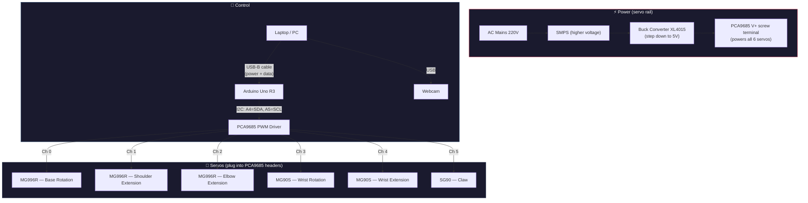

# Complete Wiring & Setup Guide — ArmAutomata 6-DOF

## System Overview



### Two completely separate paths

| Path | Purpose | Components |
|:-:|:-:|:-:|
| **Power path** | Drives servo motors | SMPS → Buck Converter → PCA9685 V+ → Servos |
| **Control path** | Sends angle commands | Laptop → USB → Arduino → I2C → PCA9685 → Servos |

> [!IMPORTANT]
> The Arduino is powered **only** by the USB cable from your laptop. The buck converter powers **only** the servos via the PCA9685. These two power paths share a **common GND** but nothing else.

---

## 1. Power Path: SMPS → Buck Converter → PCA9685 → Servos

### Why a buck converter?

Your SMPS outputs a **higher voltage than servos can handle** (servos need 5–6V). The XL4015 buck converter steps it down to a safe 5V.

```
┌──────────────┐
│ AC Mains 220V│
└──────┬───────┘
       │
       ▼
┌──────────────┐
│    SMPS      │ ← Converts mains AC to DC (higher voltage)
└──────┬───────┘
       │ DC (higher voltage)
       ▼
┌──────────────────┐
│ Buck Converter   │ ← XL4015: steps voltage DOWN to 5V
│ XL4015 5A        │    Adjust potentiometer until output = 5.0V
│ IN+  IN−         │
│ OUT+ OUT−        │
└──┬───────────┬───┘
   │ +5V       │ GND
   ▼           ▼
┌──────────────────┐
│ PCA9685          │
│ V+ screw terminal│ ← Powers ALL 6 servos
│ GND screw term.  │
└──────────────────┘
```

### Wiring

| From | → | To | Wire |
|:-:|:-:|:-:|:-:|
| SMPS **+V output** | → | Buck Converter **VIN+** | Thick (came with SMPS) |
| SMPS **−V / GND** | → | Buck Converter **VIN−** | Thick (came with SMPS) |
| Buck Converter **VOUT+** | → | PCA9685 **V+** (screw terminal, +) | Thick wire (18–22 AWG) |
| Buck Converter **VOUT−** | → | PCA9685 **GND** (screw terminal, −) | Thick wire (18–22 AWG) |

> [!CAUTION]
> **Before connecting**: Turn on the SMPS with the buck converter connected but PCA9685 disconnected. Use a multimeter on the buck converter **VOUT** and adjust the potentiometer screw until it reads exactly **5.0V**. Only then connect to PCA9685. Sending >6V to the servos can burn them out.

---

## 2. Control Path: Laptop → Arduino → PCA9685

### USB connection

Plug the Arduino Uno into your laptop with a **USB-B cable**. This provides:
- **Power** for the Arduino (5V from USB)
- **Serial data** (the Python host sends angle commands over this)

### I2C connection (Arduino → PCA9685)

Use **Dupont jumper wires** (female-to-female):

| Arduino Uno Pin | → | PCA9685 Pin | Wire Colour (suggested) |
|:-:|:-:|:-:|:-:|
| **A4** (SDA) | → | **SDA** | 🔵 Blue |
| **A5** (SCL) | → | **SCL** | 🟡 Yellow |
| **5V** | → | **VCC** | 🔴 Red |
| **GND** | → | **GND** | ⚫ Black |

> [!IMPORTANT]
> **VCC** on the PCA9685 is the **logic power** (runs the chip itself, ~10mA). This is completely separate from **V+** which powers the servos. **Both** must be connected.

### Common GND

The Arduino GND and the PCA9685 GND **must** be connected together. This happens automatically through the jumper wire above (Arduino GND → PCA9685 GND). The PCA9685's GND screw terminal is internally connected to the header GND pins, so the servo power ground and logic ground are already tied together on the board.

> [!WARNING]
> **If you skip the GND connection**, the I2C bus won't work and the servos won't respond. This is the #1 cause of "nothing happens" when you run the software.

---

## 3. Servo Connections on PCA9685

Each servo comes with a **3-pin cable already attached**. Plug them directly into the PCA9685 channel headers — **no extra wires needed**.

```
PCA9685 Board (top view)
┌─────────────────────────────────────────────┐
│  [V+]  [GND]     ← screw terminals (servo  │
│                      power from buck conv.)  │
│                                             │
│  Ch0  Ch1  Ch2  Ch3  Ch4  Ch5  Ch6 ... Ch15│
│  |||  |||  |||  |||  |||  |||              │
│  SIG  SIG  SIG  SIG  SIG  SIG             │
│  V+   V+   V+   V+   V+   V+              │
│  GND  GND  GND  GND  GND  GND             │
│                                             │
│  [VCC] [GND] [SCL] [SDA]  ← I2C header     │
│  (from Arduino 5V/GND/A5/A4)               │
└─────────────────────────────────────────────┘
       ↑     ↑     ↑     ↑     ↑     ↑
    Base  Shld  Elbow WrRot WrExt  Claw
   MG996R MG996R MG996R MG90S MG90S  SG90
```

| PCA9685 Channel | Servo to plug in | Servo Type |
|:-:|:-:|:-:|
| **Ch 0** | Base Rotation | MG996R |
| **Ch 1** | Shoulder Extension | MG996R |
| **Ch 2** | Elbow Extension | MG996R |
| **Ch 3** | Wrist Rotation | MG90S |
| **Ch 4** | Wrist Extension | MG90S |
| **Ch 5** | Claw (gripper) | SG90 |

> [!TIP]
> **Connector orientation**: On most PCA9685 boards, the pin order from the board edge inward is: **GND** (brown/black) → **V+** (red) → **Signal** (orange/white). Match the wire colours.

> If a servo cable is **too short** to reach the PCA9685, use a **servo extension cable** (3-pin, ~30cm).

---

## 4. Webcam

Plug your USB webcam into any free USB port on your laptop. No wiring to the Arduino needed — the webcam talks to the Python host software directly.

---

## 5. Complete Connection Summary

```
LAPTOP
  ├── USB ──────────► WEBCAM (video capture)
  └── USB-B cable ──► ARDUINO UNO
                        ├── A4 (SDA) ──► PCA9685 SDA
                        ├── A5 (SCL) ──► PCA9685 SCL
                        ├── 5V ────────► PCA9685 VCC (logic)
                        └── GND ───────► PCA9685 GND

SMPS (higher voltage DC)
  ├── +V ──► Buck Converter VIN+
  └── GND ─► Buck Converter VIN−

Buck Converter (output set to 5.0V)
  ├── VOUT+ ──► PCA9685 V+ screw terminal (servo power)
  └── VOUT− ──► PCA9685 GND screw terminal

PCA9685 SERVO HEADERS
  ├── Ch 0 ◄── MG996R (Base Rotation)
  ├── Ch 1 ◄── MG996R (Shoulder Extension)
  ├── Ch 2 ◄── MG996R (Elbow Extension)
  ├── Ch 3 ◄── MG90S  (Wrist Rotation)
  ├── Ch 4 ◄── MG90S  (Wrist Extension)
  └── Ch 5 ◄── SG90   (Claw)
```

---

## 6. Additional Items You'll Need

| Item | Qty | Purpose | Est. Cost (₹) |
|:-:|:-:|:-:|:-:|
| Dupont jumper wires (F-F, 20cm) | 4 | Arduino ↔ PCA9685 (SDA, SCL, VCC, GND) | ~50 |
| Thick wire 18–22 AWG (red+black, 50cm each) | 1 set | Buck converter → PCA9685 V+ power lines | ~40 |
| Servo extension cables (30cm) | 2–3 | Only if wrist/claw servo cables don't reach PCA9685 | ~60 |
| Multimeter | 1 | Verify buck converter output = 5.0V | (you likely own one) |
| Cable ties | Several | Cable management | ~20 |

> [!NOTE]
> **Total: ~₹170 for consumables.** Your main BOM covers everything else.

---

## 7. Power-On Sequence

### First time only
1. ⚡ **Calibrate buck converter** — Connect SMPS to buck converter with PCA9685 **disconnected**. Turn on SMPS. Measure buck converter VOUT with multimeter. Adjust potentiometer until it reads **5.0V**. Turn off SMPS.
2. 🔌 **Wire everything** with SMPS off and USB unplugged.
3. ✅ **Run the checklist** (section 8 below).

### Every time you use it
1. Plug **USB cable** from Arduino to laptop
2. Turn on **SMPS** → servos jump to 90° (neutral)
3. Run:
   ```
   python host/main.py --port COM3           # Windows
   python host/main.py --port /dev/ttyACM0   # Linux
   python host/main.py --port /dev/cu.usbmodem14201  # macOS
   ```
4. Show your hand/arm to the webcam — the arm follows!
5. Press **`q`** to stop

### Shutting down
1. Press `q` or `Ctrl+C`
2. Turn off SMPS
3. Unplug USB

---

## 8. Pre-Flight Checklist

- [ ] Buck converter output verified at **5.0V** with multimeter
- [ ] Buck converter **VOUT+** → PCA9685 **V+** screw terminal
- [ ] Buck converter **VOUT−** → PCA9685 **GND** screw terminal
- [ ] Arduino **A4** → PCA9685 **SDA**
- [ ] Arduino **A5** → PCA9685 **SCL**
- [ ] Arduino **5V** → PCA9685 **VCC**
- [ ] Arduino **GND** → PCA9685 **GND**
- [ ] 6 servos plugged into correct channels (0=base, 1=shoulder, 2=elbow, 3=wrist rot, 4=wrist ext, 5=claw)
- [ ] Servo connectors oriented correctly (check wire colours)
- [ ] No loose wires or exposed metal touching
- [ ] Arduino USB cable connected to laptop
- [ ] Webcam connected to laptop
